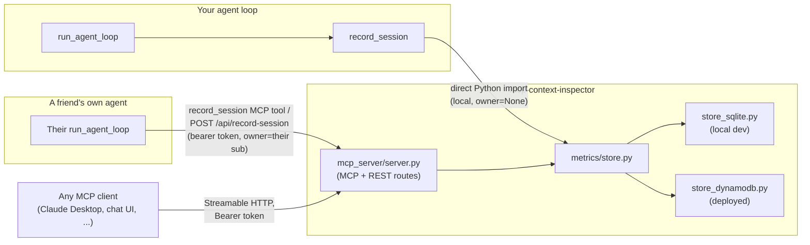

# Architecture

## Data flow



One data-access layer (`metrics/store.py`), two entry points: a direct
Python import for your own local agent (owner defaults to `None`, the
server owner), and the authenticated MCP tool / REST route for anyone
else's remote agent (owner resolved from their bearer token). Every
read goes through the same layer, filtered by `owner` — see
`docs/AUTH.md` for the isolation guarantee.

## The `record_session` contract

`record_session(prompt, model_id, loop_result, owner=None)` needs
`loop_result` to look like:

```python
{
    "trace": [{"tool": "...", "args": {...}, "status": "ok"}, ...],
    "turns": [{"input_tokens": int, "output_tokens": int, "latency_ms": int}, ...],
    "input_tokens": int, "output_tokens": int, "total_tokens": int, "latency_ms": int,
    "context_blocks": [   # optional — omit and you just lose the Explorer, nothing crashes
        {"category": "system", "label": "...", "char_count": int, "token_estimate": int, "turn_n": int | None},
        ...
    ],
}
```

`context_blocks` categories: `system`, `tools`, `user`, `reasoning`,
`thinking`, `tool_call`, `tool_result` (optionally carries a `"status"`
key for color-coding failures), `answer`.

## Storage backends

`STORAGE_BACKEND=sqlite` (default, local dev — `data/metrics.db`, or
`METRICS_DB_PATH` to point elsewhere) or `STORAGE_BACKEND=dynamodb`
(set `METRICS_TABLE`/`AWS_REGION`) — same function signatures either
way, callers in `metrics/store.py` never know which backend is active.
DynamoDB exists because a deployed container's local filesystem doesn't
persist across invocations; SQLite is enough for local dev and for a
demo deployment seeded from a fixture (`scripts/seed_demo_db.py`).
