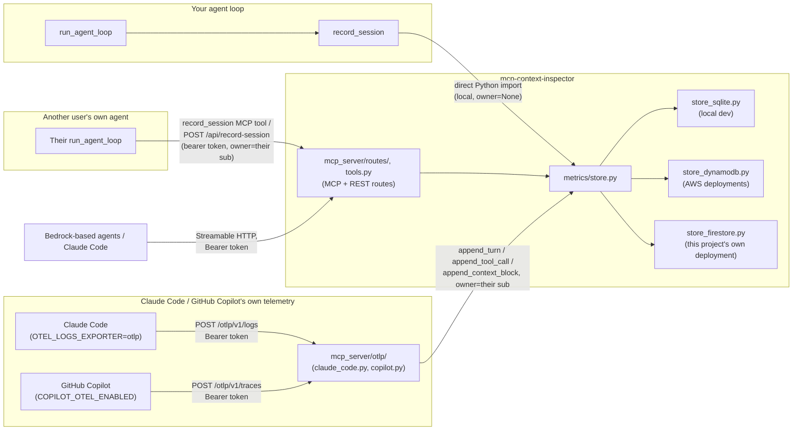

# Architecture

## Data flow



One data-access layer (`metrics/store.py`), three entry points: a
direct Python import for your own local agent (owner defaults to
`None`, the server owner), the authenticated MCP tool / REST route for
anyone else's remote agent (owner resolved from their bearer token),
and the `/otlp/v1/{logs,metrics,traces}` routes that accept Claude
Code's/Copilot's own native OpenTelemetry export directly. No
`record_session` call needed, just OTLP env vars pointed at this
server (see the README's "Claude Code / Copilot live telemetry"
section). Every read goes through the same layer, filtered by `owner`;
see `docs/AUTH.md` for the isolation guarantee.

Unlike `record_session`'s one-shot "here's the whole finished session"
write, OTLP ingestion is incremental: each batch calls
`start_or_get_session` once per session, then `append_turn`/
`append_tool_call`/`append_context_block` as new data arrives, diffing
against what's already stored so a retried/duplicate batch is safe to
reprocess. `mcp_server/otlp/claude_code.py` and `copilot.py` hold the
per-vendor mapping from each client's native OTLP attribute shape to
that append call sequence; see their module docstrings for the wire
format each is written against.

## The `record_session` contract

`record_session(prompt, model_id, loop_result, owner=None)` needs
`loop_result` to look like:

```python
{
    "trace": [{"tool": "...", "args": {...}, "status": "ok"}, ...],
    "turns": [{"input_tokens": int, "output_tokens": int, "latency_ms": int}, ...],
    "input_tokens": int, "output_tokens": int, "total_tokens": int, "latency_ms": int,
    "context_blocks": [   # optional: omit and you just lose the Explorer, nothing crashes
        {"category": "system", "label": "...", "char_count": int, "token_estimate": int, "turn_n": int | None},
        ...
    ],
}
```

`context_blocks` categories: `system`, `tools`, `user`, `reasoning`,
`thinking`, `tool_call`, `tool_result` (optionally carries a `"status"`
key for color-coding failures), `answer`.

## Storage backends

`STORAGE_BACKEND=sqlite` (default, local dev; `data/metrics.db`, or
`METRICS_DB_PATH` to point elsewhere), `STORAGE_BACKEND=dynamodb` (set
`METRICS_TABLE`/`AWS_REGION`), or `STORAGE_BACKEND=firestore` (Google
Cloud Firestore, native mode; see `docs/DEPLOYMENT.md` for the one-time
GCP setup). Same function signatures across all three, so callers in
`metrics/store.py` never know which backend is active. A deployed
container's local filesystem doesn't persist across invocations, so
SQLite alone is only right for local dev and a demo deployment seeded
from a fixture (`scripts/seed_demo_db.py`); Firestore is what this
project's own live deployment runs for durable, signed-in-user data.
The per-user auth token store (`mcp_server/auth/store.py`) follows the
same `STORAGE_BACKEND` switch and needs the same durability, since a
lost token silently breaks that user's auth.
