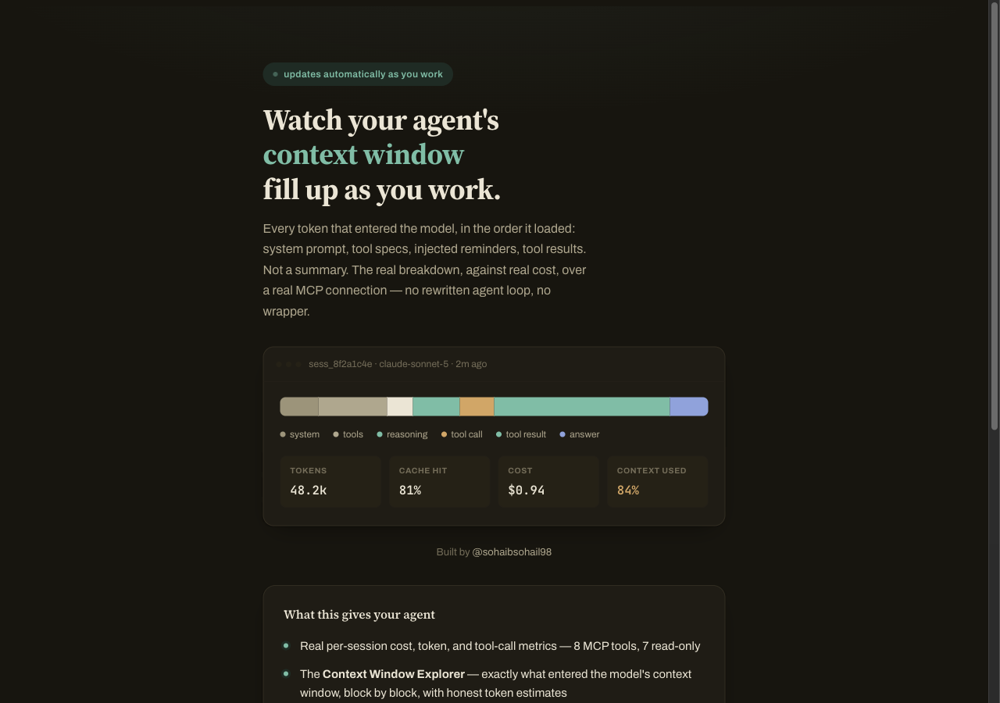

# Auth

Sign in, and you're scoped to your own data on this server. No
password, one click:



You land on a ready-to-use config: your token, the MCP server URL, and
a paste-ready Claude Code / MCP-client config block.


Two ways to get a token by hand, both accepted by the same
`Authorization: Bearer <token>` header on `/mcp` and every `/api/*`
route (a third way, for clients that can't be handed a token directly,
is covered further down):

1. **Owner token**: the `MCP_AUTH_TOKEN` env var. Yours, printed on
   startup. Fine for solo local use.
2. **Google sign-in, per person**: for anyone else you want to connect
   their own Bedrock-based agent to your server, without handing them your one
   token (and without being able to revoke just their access later).
   Set `GOOGLE_OAUTH_CLIENT_ID` (see setup below) and point them at
   `http://<your-host>:8787/auth/login`. They sign in with their own
   Google account, get a personal token minted for them
   (`mcp_server/auth_store.py`), and use that as their bearer token.
   Signing in again returns the *same* token, so pasting it into an MCP
   client config once doesn't get invalidated by a second sign-in.

That covers a client that can be handed a plain bearer token directly
(Claude Code's own MCP config, curl, a Bedrock agent). Some MCP
clients — claude.ai's Connectors UI is one — offer no way to paste a
token at all; they only speak the MCP spec's OAuth 2.1 Resource Server
flow. This server implements that too, as a third way in.

## OAuth 2.1 + PKCE (for clients that only speak OAuth)

`mcp_server/server.py`'s `/oauth/*` and `/.well-known/*` routes make
this server act as its own OAuth 2.1 authorization server, per the MCP
spec: RFC 9728 protected resource metadata, RFC 8414 authorization
server metadata, RFC 7591 dynamic client registration, and a standard
PKCE authorization-code grant. A client discovers everything itself
(hit `/mcp` with no token, follow the `WWW-Authenticate` header) — no
manual setup on either side.

The consent step reuses the same Google sign-in already described
above rather than building a separate login system: signing in *is*
the authorization. Each OAuth client gets its own freshly-minted token
(`mcp_server/auth_store.py`'s `mint_oauth_token`), kept separate from
the plain sign-in token — so disconnecting a Connector later can't
also break a paste-in-config client using the other token. Client
registrations, one-time authorization codes, and OAuth-issued tokens
all live in the same `auth_store` SQLite file as everything else here,
and inherit its documented ephemeral-storage caveat (see
`docs/DEPLOYMENT.md`).

This is deliberately the minimum viable version of a real OAuth server —
public clients only (no client secrets; PKCE carries the security
instead), tokens that don't expire (matching this server's existing
bearer-token model rather than adding refresh-token rotation), no
consent-screen customization beyond the sign-in page itself. Good
enough for what MCP clients actually need, without the extra surface a
production-grade multi-tenant authorization server would carry.

## Google Cloud setup (one-time, ~2 minutes)

1. [console.cloud.google.com](https://console.cloud.google.com): create
   or pick a project, then go to **APIs & Services → Credentials**.
2. **Create Credentials → OAuth client ID** → Application type **Web
   application**.
3. Under **Authorized JavaScript origins**, add the origin(s) you'll
   serve `/auth/login` from, e.g. `http://localhost:8787` for local
   use, plus your real domain once deployed. Use `localhost`, not
   `127.0.0.1`: Google Identity Services only reliably honors
   `localhost` for the plain-HTTP local-dev exemption. The Console UI
   will let you save `127.0.0.1` as an origin, but the live sign-in
   widget can still reject it with "origin not allowed" at runtime. No
   redirect URI needed for this flow.
4. Copy the **Client ID** (safe to expose client-side, it's not a
   secret) and set it as `GOOGLE_OAUTH_CLIENT_ID` in your environment
   before starting the server.

## Data isolation

Every session is attributed to whoever recorded it. The owner token
sees everyone's (it's your server); a per-user token only ever sees,
queries, and records its own. There's no way to read or list another
person's session_ids, even by guessing one (a session that exists but
isn't yours reads back exactly like one that doesn't exist at all; see
`metrics/store_sqlite.py`'s `get_session_metrics` docstring). Revoke a
friend's access with `mcp_server.auth_store.revoke(google_sub)` (find
their `sub` via `list_users()`) if you need to cut someone off: their
existing token stops working immediately, and any data they already
recorded stays where it is (still owned by them, invisible to other
per-user tokens, visible to yours).

## Letting a friend's own agent record its own data

`record_session` isn't just a local Python import, it's also an
authenticated MCP tool (and `/api/record-session` REST route), so a
friend's agent running *anywhere*, not sharing your Python environment
or filesystem, can push its own sessions into your server, attributed to
them:

```python
# from the friend's own agent code, after it gets its own token from
# GET http://<your-host>:8787/auth/login
import httpx

httpx.post(
    "http://<your-host>:8787/api/record-session",
    headers={"Authorization": f"Bearer {their_token}"},
    json={"prompt": prompt, "model_id": model_id, "loop_result": loop_result},
)
```

Or the equivalent as a real MCP tool call (`record_session`) over their
own MCP client connection: same shape, same auth, same attribution.
Either way, only they (and you, the owner) can read it back afterward.
